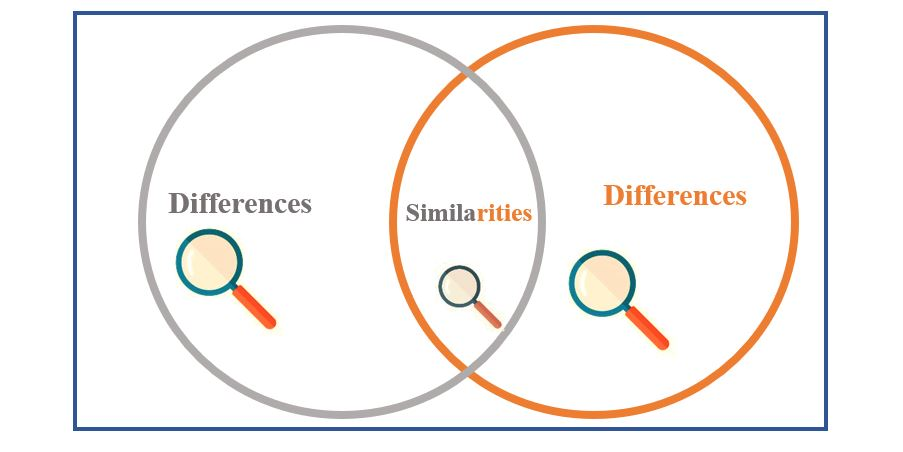

### Hexlet tests and linter status:
[](https://github.com/TeonaGZ/frontend-project-46/actions)
[](https://github.com/TeonaGZ/frontend-project-46/actions)
[](https://codeclimate.com/github/TeonaGZ/frontend-project-46/maintainability)
[](https://codeclimate.com/github/TeonaGZ/frontend-project-46/test_coverage)

# Gendiff

This is an app will help you compare two configuration files and show the difference in three formats: stylish, plain and json.

## Installation
Download the repository and run the command in terminal: 
```
make install
```
## Usage
Enter the command, the format of the result you need and the path to the files as in the example below:
```
gendiff --format json ./__fixtures__/file1.json ./__fixtures__/file2.yml
```

## Work examples
### Selecting 'help menu' and comparing flat files
[](https://asciinema.org/a/6peZC20tz6JARavVwwcbilns7)
### Comparison stylish format
[](https://asciinema.org/a/AYXAswdBuvgOLHuMWzhy47yS5)
### Comparison plain format
[](https://asciinema.org/a/Q7im6OvUj5YhafSJK61FahKBA)
### Comparison json format
[](https://asciinema.org/a/AeEJrv8fnTt1GwVLD7KXp9lyy)
